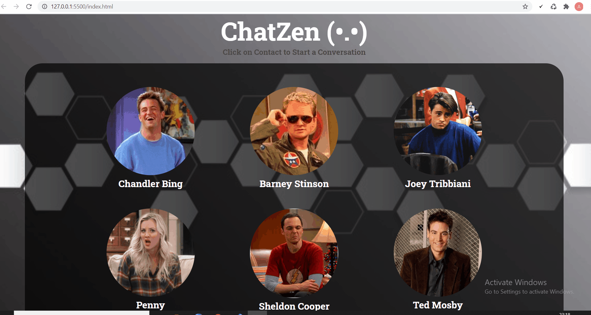

# UI for Chat Application
## ChatZen 
#### An Web-chat Application Design Template Created Using HTML5, SASS and JavaScript.
##### 
 Working Model Of the Application 

## Requirements
###### No external/addditional Requirements . Windows supported Web-Chat application template. 
###### This design also append messages from bot. 
###### To run :- Download all the files/folder and open index.html on Google Chrome.

## Langauges and Tools Used
### **HTML**
 </img>
### **SASS**
###### It is a preprocessor scripting language that is interpreted or compiled into CSS. Css codes in this project are build from scratch .NO external Framework Used.
 </img>
### **JavaScript**
###### Vanilla Javascript is used to append messages and for manipulating the DOM.
 </img>

